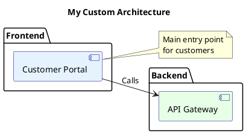

# PlantUML Setup and Rendering Guide

The EA Tool generates standard PlantUML diagrams. Here's how to view and render them.

## ✅ Recommended: VS Code Extension (Easiest)

### Installation
1. Open VS Code
2. Press `Ctrl+Shift+X` to open Extensions
3. Search for "PlantUML"
4. Install **"PlantUML" by jebbs** (the one with most downloads)

### Viewing Diagrams
1. Open any `.puml` file from the `diagrams/` folder
2. Press `Alt+D` to preview the diagram
3. Or right-click in the file → "Preview Current Diagram"

### Exporting Diagrams
1. Right-click on the preview
2. Select "Export Current Diagram"
3. Choose format: PNG, SVG, or PDF

### VS Code Extension Features
- ✅ Live preview as you edit
- ✅ Export to multiple formats
- ✅ No external dependencies needed
- ✅ Works offline
- ✅ Syntax highlighting

---

## 🌐 Option 2: Online PlantUML Server (No Installation)

### PlantUML Web Server
1. Visit: http://www.plantuml.com/plantuml/uml/
2. Copy the entire content of your `.puml` file
3. Paste into the text box
4. Click "Submit" to see the diagram

### Advantages
- ✅ No installation required
- ✅ Works from any device
- ✅ Can share URLs of diagrams

### Limitations
- ⚠️ Requires internet connection
- ⚠️ Data sent to external server
- ⚠️ No local file editing

---

## 🖥️ Option 3: Local PlantUML Installation

### Requirements
- Java Runtime Environment (JRE) 8 or higher
- Graphviz (for better layouts)

### Windows Installation

**Step 1: Install Java**
```powershell
# Download and install from: https://www.java.com/download/
# Or use winget:
winget install Oracle.JavaRuntimeEnvironment
```

**Step 2: Install Graphviz (Optional but recommended)**
```powershell
# Download from: https://graphviz.org/download/
# Or use chocolatey:
choco install graphviz

# Or use winget:
winget install graphviz
```

**Step 3: Download PlantUML**
```powershell
# Download plantuml.jar from: https://plantuml.com/download
# Or directly:
curl -o plantuml.jar https://github.com/plantuml/plantuml/releases/download/v1.2024.7/plantuml-1.2024.7.jar
```

**Step 4: Render Diagrams**
```powershell
# Single file
java -jar plantuml.jar diagrams/full-architecture.puml

# All files in directory
java -jar plantuml.jar diagrams/*.puml

# Output to PNG
java -jar plantuml.jar -tpng diagrams/full-architecture.puml

# Output to SVG (vector graphics)
java -jar plantuml.jar -tsvg diagrams/full-architecture.puml
```

---

## 🔧 Common Issues and Solutions

### Issue: "Syntax Error" or "Cannot Parse"

**Solution**: Make sure you're using the latest generated files. The EA Tool now generates standard PlantUML syntax that works everywhere.

### Issue: "ArchiMate not found" or "!include error"

**Solution**: The old version used ArchiMate library. Regenerate all diagrams:
```powershell
python3 scripts/generators/generate_puml.py
python3 scripts/generators/generate_puml.py --layer application
python3 scripts/generators/generate_puml.py --layer business
```

### Issue: VS Code extension shows "java.home" error

**Solution**: Install Java and configure VS Code:
1. Install Java (see above)
2. In VS Code: File → Preferences → Settings
3. Search for "plantuml.java"
4. Set path to your Java installation

### Issue: Diagrams look messy or overlapping

**Solution**: Add layout hints to your .puml files:
```plantuml
@startuml
' Add at top of file
left to right direction
skinparam ranksep 80
skinparam nodesep 40

' ... rest of diagram
@enduml
```

---

## 📊 Understanding the Generated Diagrams

### Color Coding by Layer
The generator uses color coding to distinguish ArchiMate layers:
- **Strategy** (#FFF4E6): Light orange - capabilities, resources
- **Business** (#FFF9E6): Light yellow - processes, actors
- **Application** (#E6F3FF): Light blue - applications, services
- **Technology** (#E6FFE6): Light green - infrastructure, servers
- **Physical** (#F0F0F0): Light gray - equipment, facilities
- **Motivation** (#FFE6F0): Light pink - goals, requirements
- **Implementation** (#F5E6FF): Light purple - projects, deliverables

### Relationship Arrows
Different arrow styles show relationship types:
- `-->` : Serving, Access, Flow
- `--` : Association, Serving (generic)
- `..>` : Influence
- `.|>` : Realization (implements)
- `--|>` : Specialization (inheritance)
- `o--` : Aggregation
- `++--` : Composition

---

## 🎨 Customizing Your Diagrams

### Edit Generated Files
You can manually edit `.puml` files after generation:



### Common Customizations

**Change Layout:**
```plantuml
left to right direction
' or
top to bottom direction
```

**Add Packages/Groups:**
```plantuml
package "System Name" {
  component "Component A" as a
  component "Component B" as b
}
```

**Add Notes:**
```plantuml
note right of componentName
  Your note here
end note

note left of componentName : Short note

note "Floating note" as N1
```

**Change Colors:**
```plantuml
component "Name" as id #FF6B6B
component "Name" as id #4ECDC4
```

---

## 🚀 Quick Start

**1. Generate Diagrams**
```powershell
cd "c:\Users\SveaUser\Documents\EA Stuff"
python3 scripts/generators/generate_puml.py
```

**2. Open in VS Code**
- Open any `.puml` file in `diagrams/` folder
- Press `Alt+D`

**3. Export**
- Right-click preview → Export → Choose format

That's it! 🎉

---

## 💡 Pro Tips

1. **Regenerate regularly**: After updating EA elements, regenerate diagrams
2. **Version control**: Commit both `.puml` and exported images
3. **Custom views**: Manually edit generated files for presentation
4. **Documentation**: Reference exported PNGs in your README files
5. **Layer focus**: Use `--layer` option for focused diagrams

---

## 📚 Further Reading

- PlantUML Official: https://plantuml.com/
- PlantUML Component Diagrams: https://plantuml.com/component-diagram
- VS Code Extension: https://marketplace.visualstudio.com/items?itemName=jebbs.plantuml
- ArchiMate Spec: https://pubs.opengroup.org/architecture/archimate3-doc/
